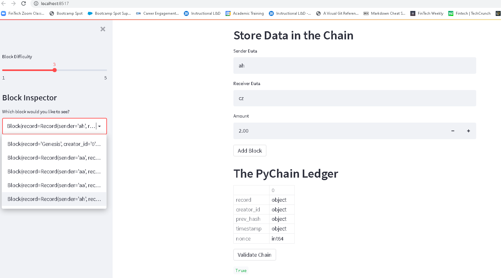
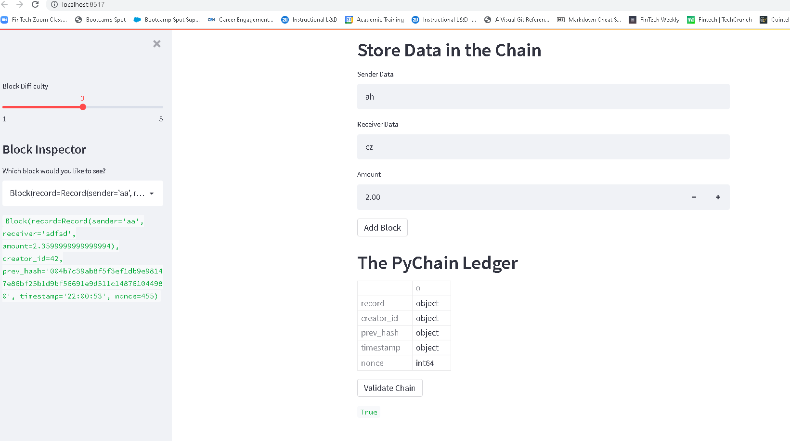

# PyChain_Ledger
Building a blockchain-based ledger system, complete with a user-friendly web interface using streamlit.

## Alexi Himarios
---

Note: There is currently a bug in Arrow which causes a conversion from numpy.dtype to pyarrow.DataType to fail. Thus, an error is thrown when trying to display df.dtypes.

The current workaround is to convert all cells to strings with df.dtypes.astype(str) until the issue is resolved.

https://discuss.streamlit.io/t/after-upgrade-to-the-latest-version-now-this-error-id-showing-up-arrowinvalid/15794/6

https://github.com/streamlit/streamlit/pull/3836

Rows 184-186 of Challenge_3.py fix this error by converting the dataframe cells to strings.

Confirming functionality of chain:

Confirming functionality of validation test:

